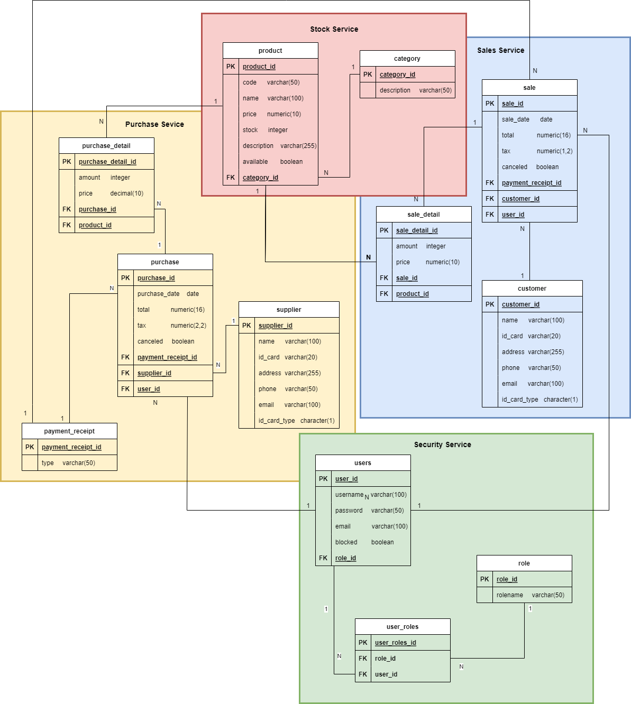
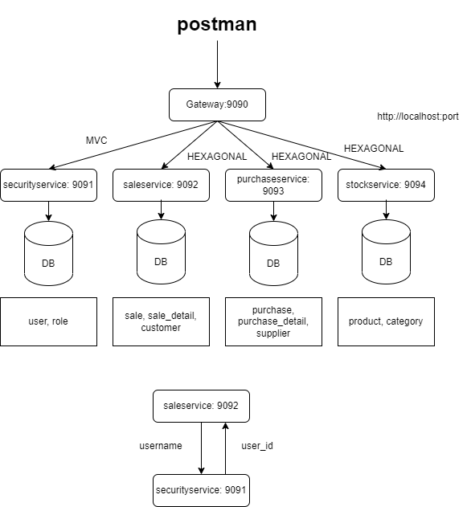

# Inventory Microservices

A group of microservies to handle the operation of a POS.
The model can handle information about customers, clients, products and its categories, purchase details (Incoming products) sale details (Outgoind products), users and its categories and payment details.

The model will be created in different schemas, these schemas will be useful to divide the application in different microservices.

There are the list of microservices that will be created.
- Security service
- Sales service
- Purchase service
- Stock service

Online diagram: https://app.diagrams.net/#G14Bx9jK6fqe4k9HpnK5hF4SMXaT2xGclW